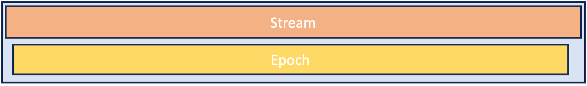
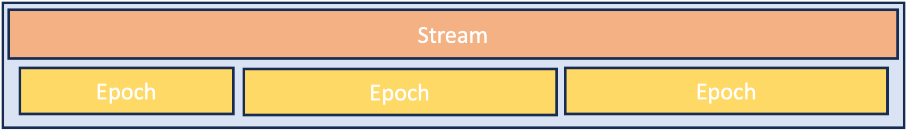
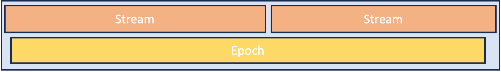

# Acquisition

[Link to code](https://github.com/AllenNeuralDynamics/aind-data-schema/blob/dev/src/aind_data_schema/core/acquisition.py)

An acquisition is single episode of data collection that creates one data asset.

The acquisition metadata is split into two parallel pieces the `DataStream` and the `StimulusEpoch`. At any given moment in time the active `DataStream`(s) represents all modalities of data being acquired, while the `StimulusEpoch` represents all stimuli being presented.

- `DataStream`: A set of devices that are acquiring data and their configurations.
- `StimulusEpoch`: All stimuli being presented to the subject. Not all acquisitions have StimulusEpochs.

A single DataStream should capture all the modalities of data acquired as a group, even when their start/stop times differ by a small amount.

Because the start and stop times are independent for data streams and stimulus epochs almost all acquisitions will fall into one of these three common types:

1. Single data stream and one stimulus epoch (including no stimulus): these acquisitions are common for imaging experiments with specimens where there might be no stimulus presented.
2. Single data stream with multiple stimulus epochs: common during animal physiology when you might do both an experimental stimulus and then follow that with one or more epochs of quite wakefulness, receptive field mapping, etc.
3. Single stimulus epoch with multiple data streams: less common, but can occur if you switch modalities during an experiment or change the configuration of an acute recording device.

## Uniqueness

You can uniquely identify acquisition sessions (and therefore a specific data asset) by their acquisition datetime (`Acquisition.acquisition_end_time`). In addition, the `Acquisition.acquisition_type` is an open `str` field where you can put conceptual information that groups similar acquisitions together. This should not be completely redundant with project names, modalities, stimulus names, or any other fields in the metadata.

For example, in the `"Brain Computer Interface"` project name, good acquisition types would be strings like: `"BCI: Single neuron stim"` and `"BCI: Group neuron stim"`. These phrases clearly identify what part of a project these acquisitions belong to, without being overly redundant with controlled fields in the metadata.

## Stimulus parameters

You should use the `Code.parameters` field to store your stimulus properties for each [StimulusEpoch](#stimulusepoch). We have pre-existing parameter schemas for a subset of stimuli defined [here](components/stimulus.md) or you can define your own schema.

## FAQs

### When should a DataStream be split in two

The `DataStream` should be split if there is a change in data modalities or a change in the configuration of devices. Or if a modality is only acquired during a subset of the time the stream is active. For example, if you acquire behavior videos for a full hour of an acquisition and only collect ecephys for twenty minutes you should separate these into two streams. If the start and ends times are within a few minutes of each other you should combine the modalities into a single stream.

### When should a StimulusEpoch be split in two

The `StimulusEpoch` should be split if the purpose of the presented stimuli changes. For example: receptive field mapping and optogenetic manipulation are two different stimulus epochs. Individual trials of optogenetic manipulation are part of a single stimulus epoch.

Most experimenters will be familiar with the idea of breaking down an experiment into blocks and then further into trials: blocks and trials are part of one stimulus epoch. Information about blocks and trials are *parameters* that describe a stimulus epoch and can be stored in the `StimulusEpoch.code.parameters`.

## Diagrams

Example acquisition demonstrating situation **1**: one data stream, one stimulus epoch.

Example acquisition demonstrating situation **2**: one data stream, multiple stimulus epochs.

Example acquisition demonstrating **3**: one stimulus epoch, multiple data streams.

## Examples

- [Ephys acquisition](https://github.com/AllenNeuralDynamics/aind-data-schema/blob/dev/examples/ephys_acquisition.py)
- [ExaSPIM acquisition](https://github.com/AllenNeuralDynamics/aind-data-schema/blob/dev/examples/exaspim_acquisition.py)
- [Bergamo ophys acquisition](https://github.com/AllenNeuralDynamics/aind-data-schema/blob/dev/examples/bergamo_ophys_acquisition.py)
- [Multi-plane ophys acquisition](https://github.com/AllenNeuralDynamics/aind-data-schema/blob/dev/examples/multiplane_ophys_acquisition.py)
- [Ophys acquisition](https://github.com/AllenNeuralDynamics/aind-data-schema/blob/dev/examples/ophys_acquisition.py)

## Core file

### Acquisition

Description of data acquisition metadata including streams, stimuli, and experimental setup.

The acquisition metadata is split into two parallel pieces: the DataStream and the StimulusEpoch.
At any given moment in time the active DataStream(s) represents all modalities of data being acquired,
while the StimulusEpoch represents all stimuli being presented.

| Field | Type | Description |
|-------|------|-------------|
| `subject_id` | `str` | Unique identifier for the subject |
| `specimen_id` | `Optional[str]` | Specimen ID is required for in vitro imaging modalities |
| `acquisition_start_time` | `datetime (timezone-aware)` |  |
| `acquisition_end_time` | `datetime (timezone-aware)` |  |
| `experimenters` | `List[str]` |  |
| `protocol_id` | `Optional[List[str]]` | DOI for protocols.io |
| `ethics_review_id` | `Optional[List[str]]` |  |
| `instrument_id` | `str` | Should match the Instrument.instrument_id |
| `acquisition_type` | `str` | Descriptive string detailing the type of acquisition, should be consistent across similar acquisitions for the same experiment. |
| `notes` | `Optional[str]` |  |
| `coordinate_system` | Optional[[CoordinateSystem](components/coordinates.md#coordinatesystem)] | Origin and axis definitions for determining the configured position of devices during acquisition. Required when coordinates are provided within the Acquisition |
| `calibrations` | List[[Calibration](components/measurements.md#calibration) or [VolumeCalibration](components/measurements.md#volumecalibration) or [PowerCalibration](components/measurements.md#powercalibration)] | List of calibration measurements taken prior to acquisition. |
| `maintenance` | List[[Maintenance](components/measurements.md#maintenance)] | List of maintenance on instrument prior to acquisition. |
| `data_streams` | List[[DataStream](acquisition.md#datastream)] | A data stream is a collection of devices that are acquiring data simultaneously. Each acquisition can include multiple streams. Streams should be split when configurations are changed. |
| `stimulus_epochs` | List[[StimulusEpoch](acquisition.md#stimulusepoch)] | A stimulus epoch captures all stimuli being presented during an acquisition. Epochs should be split when the purpose of the stimulus changes. |
| `subject_details` | Optional[[AcquisitionSubjectDetails](acquisition.md#acquisitionsubjectdetails)] |  |

## Model definitions

### AcquisitionSubjectDetails

Details about the subject during an acquisition

| Field | Type | Description |
|-------|------|-------------|
| `animal_weight_prior` | `Optional[decimal.Decimal]` | Animal weight before procedure |
| `animal_weight_post` | `Optional[decimal.Decimal]` | Animal weight after procedure |
| `weight_unit` | [MassUnit](aind_data_schema_models/units.md#massunit) |  |
| `anaesthesia` | Optional[[Anaesthetic](components/surgery_procedures.md#anaesthetic)] |  |
| `mouse_platform_name` | `str` |  |
| `reward_consumed_total` | `Optional[decimal.Decimal]` |  |
| `reward_consumed_unit` | Optional[[VolumeUnit](aind_data_schema_models/units.md#volumeunit)] |  |

### DataStream

A set of devices that are acquiring data and their configurations starting and stopping at approximately the
same time.

| Field | Type | Description |
|-------|------|-------------|
| `stream_start_time` | `datetime (timezone-aware)` |  |
| `stream_end_time` | `datetime (timezone-aware)` |  |
| `modalities` | List[[Modality](aind_data_schema_models/modalities.md#modality)] | Modalities that are acquired in this stream |
| `code` | Optional[List[[Code](components/identifiers.md#code)]] |  |
| `notes` | `Optional[str]` |  |
| `active_devices` | `List[str]` | Device names must match devices in the Instrument |
| `configurations` | List[[LightEmittingDiodeConfig](components/configs.md#lightemittingdiodeconfig) or [LaserConfig](components/configs.md#laserconfig) or [ManipulatorConfig](components/configs.md#manipulatorconfig) or [DetectorConfig](components/configs.md#detectorconfig) or [PatchCordConfig](components/configs.md#patchcordconfig) or [FiberAssemblyConfig](components/configs.md#fiberassemblyconfig) or [MRIScan](components/configs.md#mriscan) or [LickSpoutConfig](components/configs.md#lickspoutconfig) or [AirPuffConfig](components/configs.md#airpuffconfig) or [ImagingConfig](components/configs.md#imagingconfig) or [SlapPlane](components/configs.md#slapplane) or [SampleChamberConfig](components/configs.md#samplechamberconfig) or [ProbeConfig](components/configs.md#probeconfig) or [EphysAssemblyConfig](components/configs.md#ephysassemblyconfig)] | Configurations are parameters controlling active devices during this stream |
| `connections` | List[[Connection](components/connections.md#connection)] | Connections are links between devices that are specific to this acquisition (i.e. not already defined in the Instrument) |

### PerformanceMetrics

Summary of a StimulusEpoch

| Field | Type | Description |
|-------|------|-------------|
| `output_parameters` | `dict` |  |
| `reward_consumed_during_epoch` | `Optional[decimal.Decimal]` |  |
| `reward_consumed_unit` | Optional[[VolumeUnit](aind_data_schema_models/units.md#volumeunit)] |  |
| `trials_total` | `Optional[int]` |  |
| `trials_finished` | `Optional[int]` |  |
| `trials_rewarded` | `Optional[int]` |  |

### StimulusEpoch

All stimuli being presented to the subject. starting and stopping at approximately the
same time. Not all acquisitions have StimulusEpochs.

| Field | Type | Description |
|-------|------|-------------|
| `stimulus_start_time` | `datetime (timezone-aware)` | When a specific stimulus begins. This might be the same as the acquisition start time. |
| `stimulus_end_time` | `datetime (timezone-aware)` | When a specific stimulus ends. This might be the same as the acquisition end time. |
| `stimulus_name` | `str` |  |
| `code` | Optional[[Code](components/identifiers.md#code)] | Custom code/script used to control the behavior/stimulus. Use the Code.parameters field to store stimulus properties |
| `stimulus_modalities` | List[[StimulusModality](aind_data_schema_models/stimulus_modality.md#stimulusmodality)] |  |
| `performance_metrics` | Optional[[PerformanceMetrics](acquisition.md#performancemetrics)] |  |
| `notes` | `Optional[str]` |  |
| `active_devices` | `List[str]` | Device names must match devices in the Instrument |
| `configurations` | List[[SpeakerConfig](components/configs.md#speakerconfig) or [LightEmittingDiodeConfig](components/configs.md#lightemittingdiodeconfig) or [LaserConfig](components/configs.md#laserconfig) or [MousePlatformConfig](components/configs.md#mouseplatformconfig)] |  |
| `training_protocol_name` | `Optional[str]` | Name of the training protocol used during the acquisition, must match a protocol in the Procedures |
| `curriculum_status` | `Optional[str]` | Status within the training protocol curriculum |
