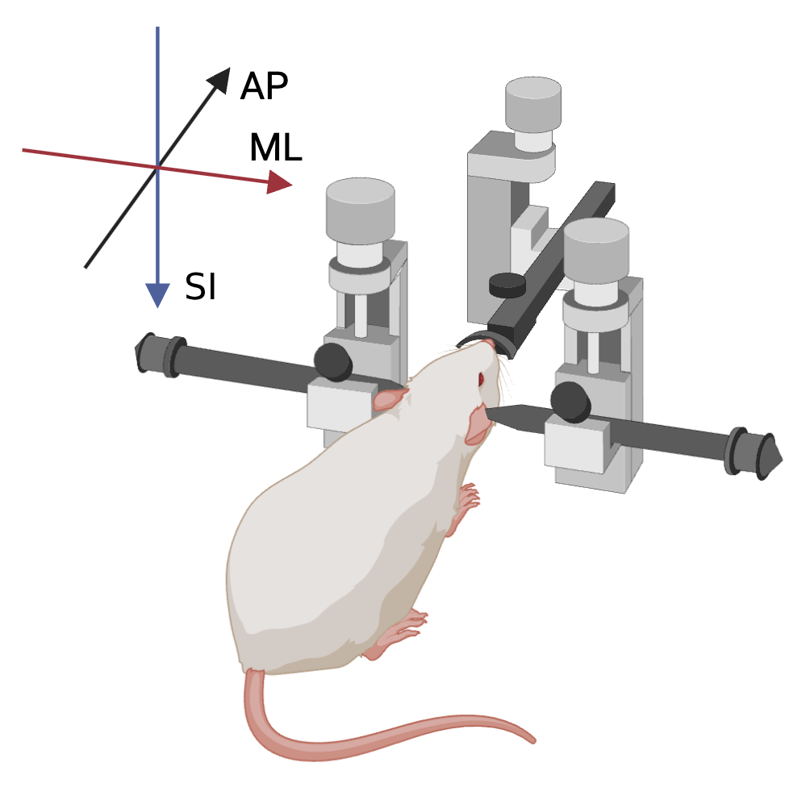
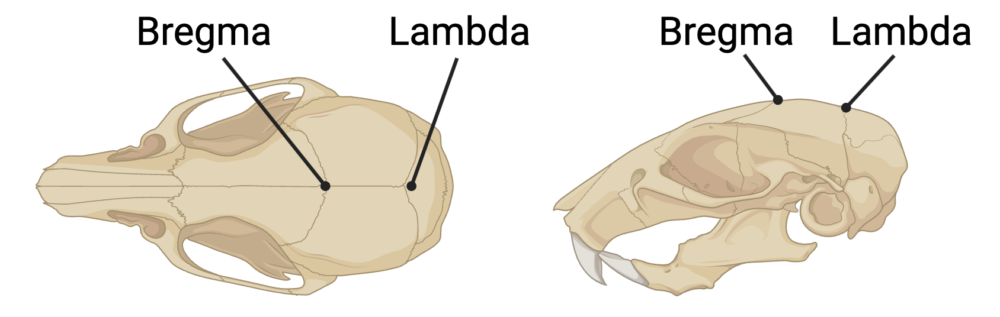

# Coordinate systems

The metadata schema supports flexible definitions of coordinate systems, both relative to anatomy and devices. This allows us to store the positions of devices, insertion coordinates, etc, all with one standardized system.

Unlike many parts of the metadata schema where fields are just floats or strings, it is critical to understand **how coordinate systems are stored in the schema** to be able to use them properly. There are two rules to be aware of:

1. Each [Instrument](instrument.md), [Acquisition](acquisition.md), and [Procedures](procedures.md) has its own `.coordinate_system` field. In most assets, the coordinate system is the same in all three files.
2. Any transform (i.e. a [Translation](components/coordinates.md#translation), [Rotation](components/coordinates.md#rotation), or [Scale](components/coordinates.md#scale)) defined for a device or configuration of a device **must be defined in it's core file's coordinate system**. To help you avoid mistakes, transform fields are paired with a `.coordinate_system_name` field and the coordinate system name must match the name of the coordinate system defined in the core file.

The top-level coordinate systems in the instrument, acquisition, and procedures are generally defined in *in vivo* space, usually relative to an origin on an animal's skull. Often when targeting coordinates in the brain we plan our experiments in a **standardized atlas** like the mouse common coordinate framework. When you encounter a field that that requires an atlas transform (i.e. a point or vector in an atlas), you'll see that an [Atlas](components/coordinates.md#atlas) will have to be defined alongside that transform. An Atlas library is available in `aind_data_schema.components.coordinates.AtlasLibrary` for your convenience.

## CoordinateSystem

A [CoordinateSystem](components/coordinates.md#coordinatesystem) is defined by an [Origin](aind_data_schema_models/coordinates.md#origin) and a list of [AxisName](aind_data_schema_models/coordinates.md#axisname) and [Direction](aind_data_schema_models/coordinates.md#direction) pairs. The name of a coordinate system is created by combining the origin and positive directions of the axes. For example, `BREGMA_ARI` is a coordinate system with an origin at bregma and three axes pointing anterior, right, and inferior. This is made explicit in the full definition:

```{code} python
CoordinateSystem(
    name="BREGMA_ARI",
    origin=Origin.BREGMA,
    axis_unit=SizeUnit.UM,
    axes=[
        Axis(name=AxisName.AP, direction=Direction.PA),
        Axis(name=AxisName.ML, direction=Direction.LR),
        Axis(name=AxisName.SI, direction=Direction.SI),
    ],
)
```

This matches the image below:

<div align="center">
    
</div>

### Origin

An [Origin](aind_data_schema_models/coordinates.md#origin) is a point in space, often relative to the mouse's anatomy but it can also be a point on a device. Standard anatomical references are positions like Bregma or Lambda

<div align="center">
    
</div>

### Axis

Each [Axis](components/coordinates.md#axis) is a combination of an [AxisName](aind_data_schema_models/coordinates.md#axisname) and [Direction](aind_data_schema_models/coordinates.md#direction).

### CoordinateSystemLibrary

We know that allowing complete flexibility with coordinate systems will be a source of confusion. With that in mind, we encourage everybody to use the `CoordinateSystemLibrary` class, which comes with a pre-defined set of standard coordinate systems. For example, you can import the `BREGMA_ARI` coordinate system and then re-use it as follows:

```{code} python
from aind_data_schema.components.coordinates import CoordinateSystemLibrary

...

coordinate_system = CoordinateSystemLibrary.BREGMA_ARI
coordinate_system_name = CoordinateSystemLibrary.BREGMA_ARI.name
```

You can always define your own coordinate system. If you find yourself re-using a coordinate system that isn't available in the library across multiple projects, please request an update to the library by opening an [issue](https://github.com/AllenNeuralDynamics/aind-data-schema/issues).

## Device transforms

To understand the position and orientation of a **device** in an instrument requires knowing three things: (1) the coordinate system for the instrument, (2) the coordinate system for the device, and (3) the coordinate system transform i.e. how a point in one coordinate system is translated, rotated, and scaled to the other. For example, a [CameraAssembly](components/devices.md#cameraassembly) is a positioned device: it has three special fields `relative_position`, `coordinate_system`, and `transform`. The relative position is required for all positioned devices while the transform and coordinate system are only required when a device's exact position will have an impact on the interpretation/analysis of data.

The transform we require for devices is the device to instrument transform. I.e. given the origin of the device (0, 0, 0) and the three axis directions, what will be the position of the origin and what direction will the three axes point in the instrument's coordinate system.

Here is an example of an affine rotation matrix and a translation applied to a [Monitor](components/devices.md#monitor) device being positioned in the standard `BREGMA_ARI` coordinate system, see above for the definition. Note that the affine matrix and translation could be composed together, we're keeping them separate here for interpretability.

```
Monitor(
    relative_position=[AnatomicalRelative.ANTERIOR, AnatomicalRelative.LEFT, AnatomicalRelative.INFERIOR],
    coordinate_system=CoordinateSystemLibrary.SIPE_MONITOR_RTF,
    transform=[
        Affine(
            affine_transform=[
                [
                    -0.80914,
                    -0.58761,
                    0,
                ],
                [
                    -0.12391,
                    0.17063,
                    0.97751,
                ],
                [
                    -0.5744,
                    0.79095,
                    -0.21087,
                ],
            ],
        ),
        Translation(
            translation=[
                0.08751,
                -0.12079,
                0.02298,
            ],
        ),
    ],
)
```
