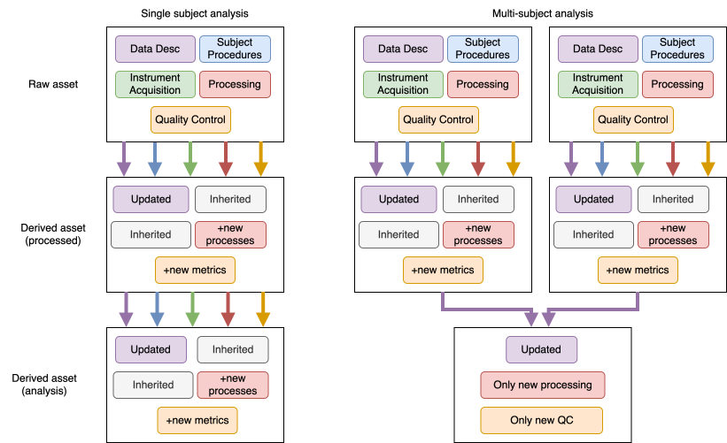

# Derived metadata

The subject and procedures core files are tied to a single subject, while the rest of the core files are related to an individual acquisition of data. Because of this, metadata inheritance for derived assets depends on how you combine assets across subjects. The following table demonstrates the basic principle, and a helper function `Metadata.from_metadata` exists to make it easy to inherit the correct metadata in your derived assets.



The four specific principles to follow are:

- All derived assets need an updated **Data Description**
- If a derived asset is related to a single subject, inherit the **Subject** and **Procedures** unchanged. Otherwise, drop these files.
- If a derived asset is related to a single acquisition, inherit the **Instrument** and **Acquisition** unchanged. Otherwise, drop these files.
- If a derived asset is related to a single acquisition, *accumulate* **Processing** and **Quality Control**. Otherwise, start these files from scratch in the new asset.

Most users should rely on the `Metadata.from_metadata` function which implements all four of these rules for you. Load your core files and validate them as a `Metadata` object as well as any new `Processing` or `QualityControl` core data that was generated during your processing or analysis, then pass all three objects to the function.

Note that relying on aggregated reference data (such as the CCF template) in your processing pipeline or analysis code does not make your asset multi-subject.

## Example

```python
from datetime import datetime, timezone

from aind_data_schema.core.metadata import Metadata
from aind_data_schema.core.processing import DataProcess, Processing, ProcessName, ProcessStage
from aind_data_schema.core.quality_control import QCMetric, QCStatus, QualityControl, Stage, Status
from aind_data_schema.components.identifiers import Code
from aind_data_schema_models.modalities import Modality

# Load and validate source metadata (e.g. from a JSON file)
source = Metadata.model_validate_json(open("metadata.nd.json").read())

# Define the new processing you performed
new_processing = Processing.create_with_sequential_process_graph(
    data_processes=[
        DataProcess(
            process_type=ProcessName.IMAGE_TILE_FUSING,
            name="Tile fusing",
            experimenters=["Dr. Dan"],
            stage=ProcessStage.PROCESSING,
            start_date_time=datetime(2024, 1, 15, 10, 0, 0, tzinfo=timezone.utc),
            end_date_time=datetime(2024, 1, 15, 12, 0, 0, tzinfo=timezone.utc),
            code=Code(url="https://github.com/my-org/my-pipeline", version="1.0.0"),
        ),
    ]
)

# Define any new QC metrics
new_qc = QualityControl(
    metrics=[
        QCMetric(
            name="Fused image SNR",
            modality=Modality.SPIM,
            stage=Stage.PROCESSING,
            value=42.5,
            status_history=[
                QCStatus(evaluator="Automated", status=Status.PASS, timestamp=datetime.now(timezone.utc))
            ],
            tags={"step": "fusing"},
        ),
    ],
    default_grouping=["step"],
)

# Create the derived metadata -- this applies all four inheritance rules
derived = Metadata.from_metadata(
    source,
    process_name="tile-fusing",
    location="s3://my-bucket/derived-asset",
    new_processing=new_processing,
    new_quality_control=new_qc,
)

derived.write_standard_file(output_directory="path/to/output")
```
