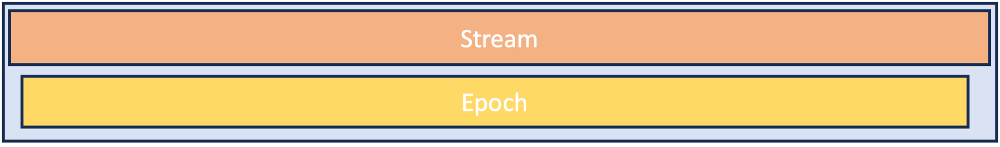
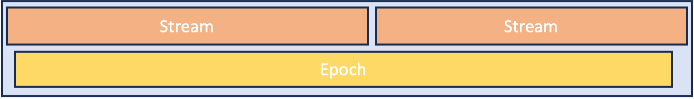
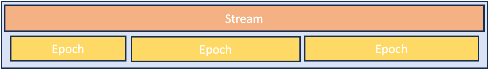

Session
=======

**Q: What is a session?** 

A single episode of data collection that creates one data asset. We use `session` in reference to physiology and 
behavior data and `acquisition` in reference to light sheet imaging.

**Q: What does this file contain?**

This schema returns information about the data acquisition. It details what instrument devices were active, any session 
specific device parameters (e.g. laser power), and what the subject was doing during the session. A session consists of 
parallel `Streams` and `Stimulus Epochs`, described below.

**Q: What are Streams?**

A stream is the data that is being acquired at one time. A stream can contain multiple modalities, for instance: ecephys, 
behavior videos, and behavior. They are part of one stream if they are being acquired simultaneously and their start and 
end times are roughly the same. A single session may consist of a single stream, or there can be multiple streams in a 
session (e.g. if Neuropixels probes are repositioned part way through the session).

**Q: What are Stimulus Epochs?**

The Stimulus Epoch describes any stimulus/behavior information. This can include behavioral tasks, sensory stimuli, 
optogenetic stimulation, etc. A session can have a single or multiple stimulus epochs. And, importantly, the timing of 
the streams and the stimulus epochs may or may not be aligned.

**Q: Hunh? I’m confused.**

Perhaps these diagrams can help?

Example session with single stream and epoch

Example where the animal is engaged with a single behavior, and there are two distinct data streams. E.g. repositioned 
probes to target different structures. 

Example where there is one data stream during the session, but multiple stimulus epochs. E.g. active behavior, passive 
behavior replay, and optotagging.

**Q: Why do both Stream and Stimulus Epoch have a field for `light_source_configs`?**

The Stream describes the data being collected. A light source involved in data acquisition (e.g. the laser used for 
2-photon imaging) should be described in the Stream. The Stimulus Epoch describes any stimulus/behavior that occurs 
during the session. A light source involved in a stimulus (e.g. the laser used for optotagging or photostim) should be 
in the Stimulus Epoch.

**Q: How do I create a stimulus table?**

A stimulus table is not part of the metadata but is part of the data itself. We track high level stimulus parameters in 
the Stimulus Class, but the trial-by-trial stimulus information belongs in the NWB file itself.

**Q: Can you explain the `stimulus_parameters` field? How do I use this?**

Great question! We began defining specific classes for different stimulus and behavior modalities, but quickly found 
that this won't be scalable. You can currently use these classes if they work for you. However, in the long run we 
would like this to move into the `script` field. This field uses the Software class, which has a field for stimulus 
parameters, where users can define their own dictionary of parameters used in the script to control the stimulus/
behavior. We recommend that you use software to define these and be consistent within your projects. Please reach out 
with questions and we can help you with this.

**Q: What should I put for the `session_type`?**

Ideally a short phrase that describes the session that you use consistently within the project. This field serves to
identify related sessions.

**Q: How do I create the session file?**

We are working with scientific teams to create metadata mappers to ingest this metadata using both acquisition software 
and SLIMS. Until this is fully functional, these files must be created manually.

**Q: How do I know if my mouse platform is "active"?**

There are experiments in which the mouse platform is actively controlled by the stimulus/behavior software - i.e. the 
resistance of the wheel is adjusted based on the subjects activity. This is an "active" mouse platform. Most platforms 
we use are not active in this way.

**Q: How do I use the Calibration field?**

This is to track any device calibrations that are performed, such as gamma correction for monitors, reward valve 
delivery calibration, laser power calibration, etc. For calibrations that are done less frequently (e.g. gamma 
correction) this can be documented in the Rig schema. For calibrations that are done frequently, they can do documented 
in the Session schema. Both places use the same class. This class identifies which device is calibrated (using the 
device's name), a description of the calibration (e.g. "Laser power calibration"), and then an input dictionary and an 
output dictionary. You can use this as makes most sense for your needs, but we envision the input dictionary having 
input values (say laser power percentage settings) and the output dictionary having output values (say the measured 
wattage out of the laser). You define the key and provide a list of the values. We recommed that you use the same 
dictionary structures when you do the same calibrations (when possible).
